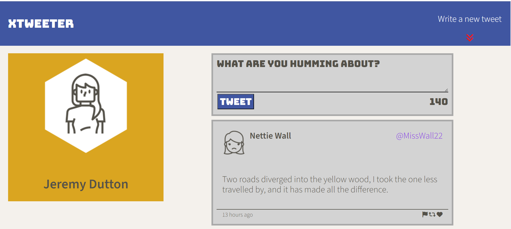
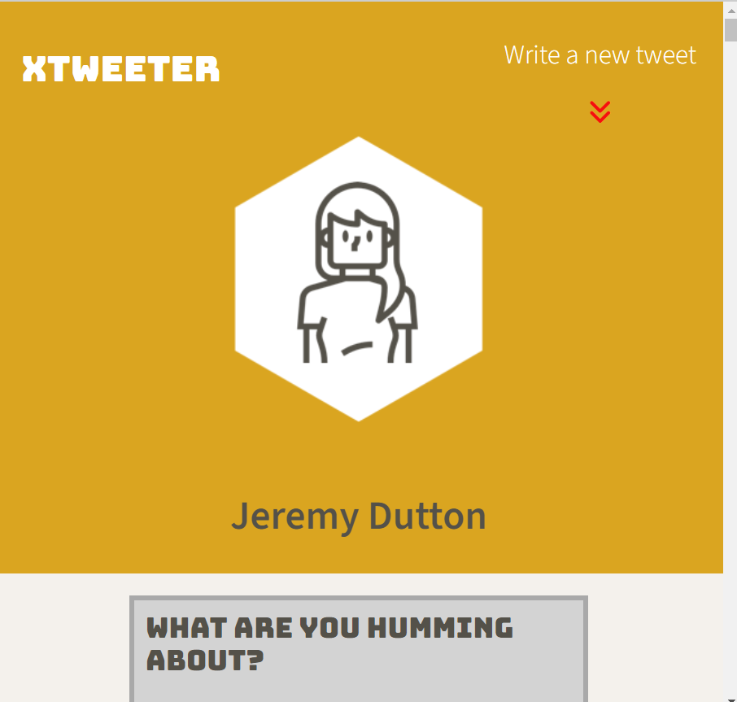
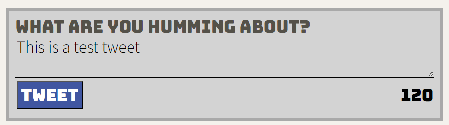
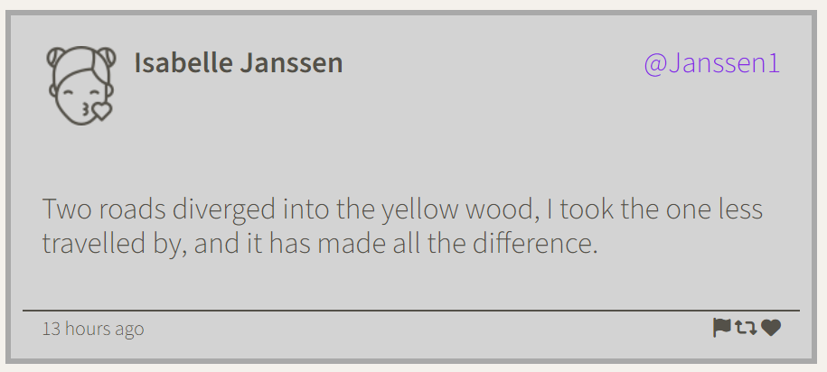

# xTweeter Project

xTweeter is a simple, single-page Twitter clone for my Lighthouse Labs Web Development bootcamp

## Purpose

**_BEWARE:_ This library was published for learning purposes. It is _not_ intended for use in production-grade software.**

This project was created and published by me (Jeremy Dutton) as part of my learnings at Lighthouse Labs.

## Documentation

The app possesses the following functionality:
- Accepts new tweets via a form and stores them in a object
- Displays the tweets in reverse chronological order
- Displays the character count of the tweet
- Prevents user from submitting a blank tweet or a tweet in excess of 140 characters
- Provides feedback in the form of visual warning element when users attempt to submit a tweet with either no characters, or more than 140
- The layout of the app re-adjusts for desktop view (> 1024 characters) or mobile/tablet view (less than 1024 characters)

## screeshots

## Dependencies

- Express
- Node 5.10.x or 
- body-parser 1.15.2
- chance 1.0.2
- express 4.13.4
- md5 2.1.0

## Getting started

* Install all dependencies using the npm install command
* Run the express_server.js file
* Go to port 8080 endpoint /register